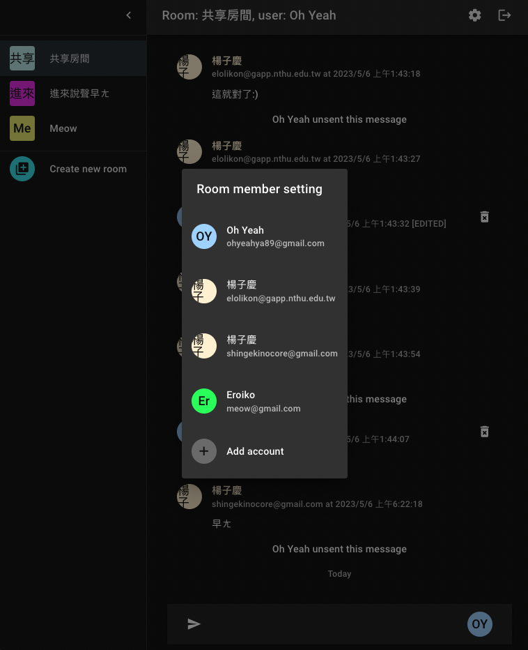
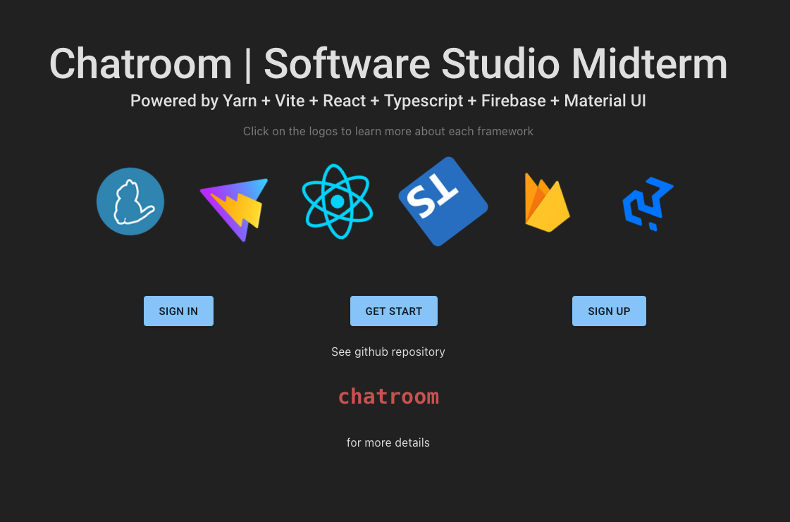

# Chatroom

> Version 1.0

The `React` + `Typescript` + `Yarn` + `Vite` + `Firebase` + `Material UI` project!

## Try it!

I've deployed it on firebase, you can check the link below :)

👉 [`https://chatroom-10387.web.app`](https://chatroom-10387.web.app)

Below is an example of using it. You can preview the webpage by jumping to [`https://chatroom-10387.web.app/home`](https://chatroom-10387.web.app/home) page since I implemented the web app with React Router v6.

> Of course, directly jump without authentication will limit function you may do. 🫠

> Also notice that the date time display is based on your locale.

You can also route to other pages such as `/404`, `/sign`, `/signin`, `/signup`. See `src/util/router` for more details.

## Frameworks

> See `package.json` for more details.

Below is the index page...

## Functions

* Sign in/sign up/sign out with email/google account
* Validation check for all emails/passwords
* Page router
* Full RWD
* Room: (synchronized) create room, add user use email, change room name
* Message: (synchronized) send/change/unsent messages
* Date time hint in chatroom
* Auto generated colorful Avatar (customized hash algo)
* Alert and "idol" notification

## Current Expectation

> Well, the most possible time for next update may be at summer, though QQ

* Profile customization
* More about room member management
* Add more information, describe functions of chatroom
* Share how to implement the whole project

## Wallpaper

星野愛, thank you for you 輝き! I can't finish it without you starry eye! 一生推し www

> 今日も嘘をつくの この言葉がいつか本当になる日を願って...